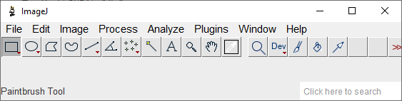
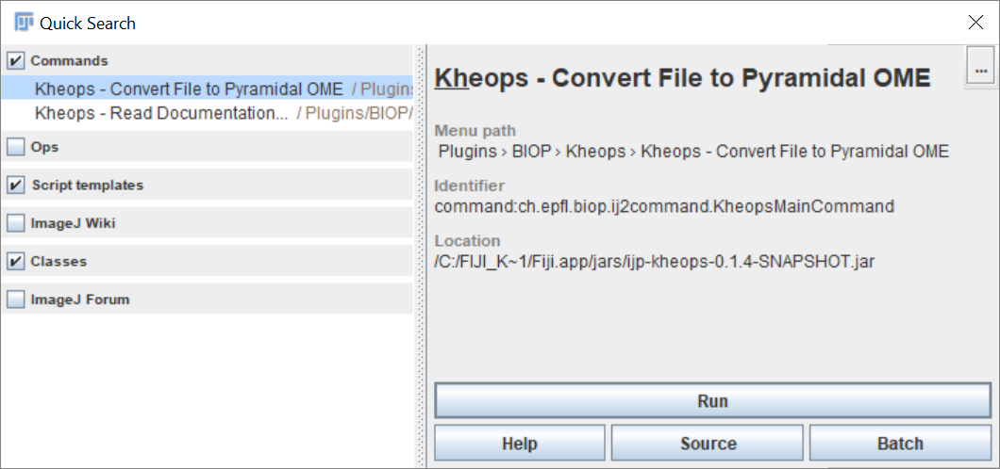
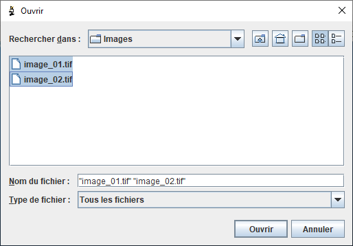

[](https://github.com/BIOP/ijp-kheops/actions/workflows/build-main.yml)


**Kheops** is an ImageJ/Fiji plugin that **converts Bio-Formats readable files to pyramidal ome.tiff** files. It can also be used to save an opened image to a pyramidal ome.tiff file.

It has been tested on 8-bit and 16 bits fluorescent images as well as 24-bits RGB images. Multi-series files are also supported: each image is exported to an individual ome.tiff file.

It can be used furthermore to set the physical pixel sizes during conversion, if the original file is not calibrated.

Downscaled images are generated by computing the average of higher resolution images, and not by sampling a single pixel. This leads to higher SNR of downscaled versions (left: kheops, right: bftools):


## Install

It is a tool targeted for [ImageJ/Fiji](https://imagej.net/software/fiji/). It can be installed through the [BIOP update site ](https://c4science.ch/w/bioimaging_and_optics_platform_biop/image-processing/imagej_tools/update-site/).

## Convert A Single File to Pyramidal OME TIFF

1.Use the `Search` tool



2.Search for Kheops




 - **Select an input file (required)**: Select the file you want to convert to a pyramidal ome.tiff 
 - **Specify an output folder (optional)**: By default, it will save the ome.tiff in the same folder 
 - **Override voxel sizes**: if your original file is not calibrated, NOW is the occasion to set the correct pixel size. Note that if the image is a multi-series image, all images will have the same voxel size.
 - **Voxel size in micrometer (XY)**: if `Override voxel sizes` is checked, the output images will use this value to set the voxel size along the X and Y dimension
- **Voxel size in micrometer (Z)**: if `Override voxel sizes` is checked, the output images will use this value to set the voxel size along the Z dimension

For the sake of simplicity, only a few saving parameters are left to the users. The files are compressed using lzw compression, tiled with a tile size of 512x512, and pyramidal levels are computed with a downscaling factor 2 until the top level is a single tile (X or Y dimension below 512 pixels).

## Convert Multiple Files to Pyramidal OME TIFF (Batch Mode) </h3> 

1.Use the `Search` tool


2.Search for Kheops


3.Click `Batch`

4.Select images



5.Click  `Open`

## Kheops - Convert Image to Pyramidal OME

This command converts the currently opened Image to a pyramidal ome.tiff file. Contrary to the file conversion, the image will not be tiled.

## Kheops - Read Documentation ...
You arrive on this page.

## Macro Language Code Example

```
//@File(Label="Select a file", style="" ) input_path
output_dir = File.getParent(input_path);

run("Kheops - Convert File to Pyramidal OME", "input_path=["+input_path+"] output_dir=["+output_dir+"] override_voxel_size=false vox_size_xy=0.0 vox_size_z=0.0");
```

# Alternative to Kheops, differences and benchmark

[**`bftools`** can be used for similar functionalities](https://docs.openmicroscopy.org/bio-formats/5.9.1/users/comlinetools/index.html). At the core of kheops, the same library is used (readers and writers from bio-formats). However, kheops has been optimized in order to parallelize operations whenever possible. Reading is usually parallelized, however, writing is only performs with multi-series files. This can lead to performance improvement ranging from 10% up to a factor 5 for multi-series files. 

An optimized workflow from Glencoe also exists that performs fast conversion to OME-TIFF. Documentation and installation instructions for this workflow [can be found here](https://c4science.ch/w/bioimaging_and_optics_platform_biop/image-processing/qupath/ome-tiff-conversion/).

However, note that, as of today, neither `bftools` nor the glencoe optimized workflow average images when building pyramids. Instead, they downsample by picking a single pixel from the underlying ones. This may lead to unpleasant noisy downscaled images. 

Here is a comparison kheops (left) and the 2 other methods (right):


We measured the conversion performance for a few test images between these methods. The test machine is a 16 core computer from 2018, the file is on a SSD drive and written to the same drive.

## Fibroblasts-007.lif; 4096 x 4096 pixels, 4 channels, 67 slices, 8 bits

4 resolution levels computed (1 2 4 8), downscaling factor = 2, lzw compression

File Size | Method | Run time | Effective speed (Mo/s) 
--- | --- | --- | ---
4.18 GB | Kheops | 133s | 32.2 Mo/s
4.18 GB | BfTools | 142s | 30.1 Mo/s
4.18 GB | Glencoe | 41s | 104.4 Mo/s

Serial writing to SSD is clearly the limiting factor. Bioformats should allow, to some extent, to parallel write on a single file, but I only managed to get mixed up tiles.  

## ConvalariaTiles.lif; 80 series, 2048 x 1536 pixels, RGB, 1 slice

3 resolution levels computed (1 2 4), downscaling factor = 2, lzw compression

File Size | Method | Run time | Effective speed (Mo/s)
--- | --- | --- | ---
729 Mo | Kheops | 5s | 146 Mo/s
729 Mo | BfTools | 27s | 27 Mo/s
729 Mo | Glencoe | 28s | 26 Mo/s

Kheops can parallel write since each series is written to a different file. That's why it can outperform the glencoe conversion in this particular case.

Other factors can affect the conversion speed. These factors are accessible through the API but not through the command in ImageJ.

File Size | Method | Condition | Run time | Effective speed (Mo/s)
--- | --- | --- | --- | ---
4.18 GB | Kheops | - | 133s | 32.2 Mo/s
4.18 GB | Glencoe | - | 41s | 104.4 Mo/s
4.18 GB | Kheops | no pyramid | 61s | 70.2 Mo/s
4.18 GB | Kheops | no compression | 153s! | 28 Mo/s
4.18 GB | Kheops | no pyramid & no compression | 53s | 80.8 Mo/s
4.18 GB | Kheops | tile = 1024 (not 512) | 96s | 44.6 Mo/s
4.18 GB | Kheops | tile = 1024 & no pyramid & no compression | 40s | 107.0 Mo/s

Note that [files are temporarily written two times when pyramids are built](https://forum.image.sc/t/ome-tiff-saving-optimisation-reading-from-the-file-thats-being-written/65705/7).

# Deprecated Kheops Command

This tool used to directly wrap `bftools` from bio-formats, but it has been modified for performance and simplicity. You can still access the deprecated function and the legacy documentation can be [found here](https://github.com/BIOP/ijp-kheops/blob/ac323c324e6db86d5ef614296d4388fc438d8e05/README.md).


