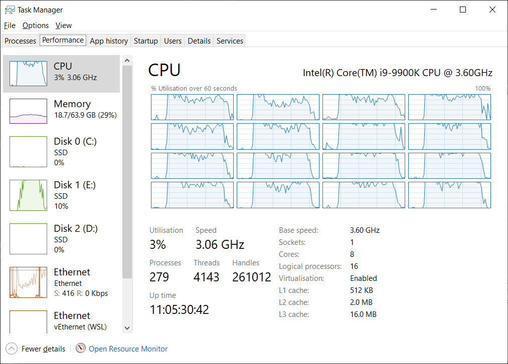
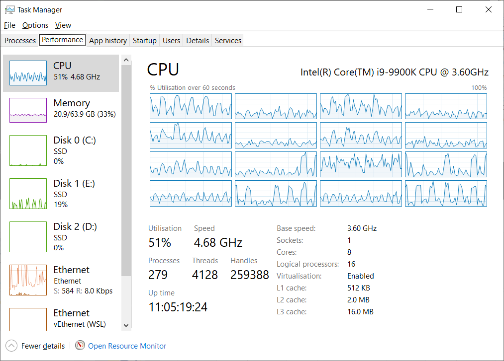

[](https://github.com/BIOP/ijp-kheops/actions/workflows/build-main.yml)


**Kheops** is an ImageJ/Fiji plugin that **converts Bio-Formats readable files to pyramidal ome.tiff** files. It can also be used to save an opened image to a pyramidal ome.tiff file.

It has been tested on 8-bit and 16 bits fluorescent images as well as 24-bits RGB images. Multi-series files are also supported: each image is exported to an individual ome.tiff file.

If the original file is not calibrated, you can specify the physical pixel size for the exported file (and that would be a very good idea).

During the 'pyramidisation', downscaled images are generated by computing an average (in XY) over the previous higher resolution scale, and not by picking a single pixel value (nearest neighbor: NN). This leads to high SNR of low resolution scaled versions (left: Average, right: NN):


## Install

It is a tool targeted for [ImageJ/Fiji](https://imagej.net/software/fiji/). It can be installed through the [BIOP update site ](https://c4science.ch/w/bioimaging_and_optics_platform_biop/image-processing/imagej_tools/update-site/).

## Convert A Single File to Pyramidal OME TIFF

1. Use the Fiji search bar and type `kheops`


2. Select `Kheops - Convert File to Pyramidal OME`


3. Click `Run`


 - **Select an input file (required)**: Select the file you want to convert to a pyramidal ome.tiff 
 - **Specify an output folder (optional)**: By default, it will save the ome.tiff in the same folder 
 - **Override voxel sizes**: if your original file is not calibrated, NOW is the occasion to set the correct pixel size. Note that if the image is a multi-series image, all images will have the same voxel size.
 - **Voxel size in micrometer (XY)**: if `Override voxel sizes` is checked, the output images will use this value to set the voxel size along the X and Y dimension
- **Voxel size in micrometer (Z)**: if `Override voxel sizes` is checked, the output images will use this value to set the voxel size along the Z dimension

For the sake of simplicity, only a few saving parameters are left to the users. The output file is compressed using lzw compression, tiled with a tile size of 512x512, and pyramidal levels are computed with a downscaling factor 2 until the top level is a single tile (X or Y dimension below 512 pixels).

## Batch Convert Files to Pyramidal OME TIFF </h3> 

If you need to convert several files, this is the preferred command. It can be very fast because all cores are used and each core is processing a single file. Reading and writing can thus happen in parallel. For maximum speed, you may choose a different drive between inputs and outputs.

1. Use the Fiji search bar and type `kheops`
2. Select `Kheops - Batch Convert File to Pyramidal OME`
3. Click `Run`


4. Select the images to convert in the file array widget, the other options are identical to the single file mode. 

## Kheops - Convert Image to Pyramidal OME

This command converts the currently opened Image to a pyramidal ome.tiff file. Contrary to the file conversion commands, the image will not be tiled.

## Kheops - Read Documentation ...
You arrive on this page.

## Macro Language Code Example

```
//@File(Label="Select a file", style="" ) input_path
output_dir = File.getParent(input_path);

run("Kheops - Convert File to Pyramidal OME", "input_path=["+input_path+"] output_dir=["+output_dir+"] override_voxel_size=false vox_size_xy=0.0 vox_size_z=0.0");
```

# Alternative to Kheops, differences and benchmark

[**`bftools`** can be used for similar functionalities](https://docs.openmicroscopy.org/bio-formats/5.9.1/users/comlinetools/index.html). At the core of kheops, the same library is used (readers and writers from bio-formats). However, kheops has been optimized in order to parallelize operations whenever possible. Reading is usually parallelized, however, writing parallelization is only performed when multiple files are written (multi-series file or batch conversion). This can lead to performance improvement ranging from 10% up to a factor 5. 

An optimized workflow from Glencoe also exists that performs fast conversion to OME-TIFF. Documentation and installation instructions for this workflow [can be found here](https://c4science.ch/w/bioimaging_and_optics_platform_biop/image-processing/qupath/ome-tiff-conversion/).

However, note that, as of today, neither `bftools` nor the glencoe optimized workflow average images when building pyramids. Instead, they downsample by picking a single pixel from the underlying ones (written NN : nearest neighbor in the benchmark tables). This may lead to unpleasant noisy downscaled images. 

Here is a comparison kheops (left) and the 2 other methods (right):


We measured the conversion performance for a few test images between these methods. 

## Benchmark - conversion of a single file

All tests have been performed with bio-formats 9.6.1. The test machine is a 16 core (Intel core i9-9900K), Win 10. Files are read from a SSD drive and written back to the same drive.

### Single file, single series

The test file `Fibroblasts-007.lif` is a 4.18Gb uncompressed image (4096 x 4096 pixels, 4 channels, 67 slices, 8 bits). Four resolution levels are computed with a factor 2 between scales (1 2 4 8), with lzw compression.

File Size | #Input files | # Output files | Method | Downsampling Method | Run time | Effective speed (Mo/s) 
--- | --- | --- | --- | --- | --- | ---
4.18 GB |1|1| **Kheops** | Average | 133s | **32.2 Mo/s**
4.18 GB |1|1| Glencoe | NN | 41s | 104.4 Mo/s
4.18 GB |1|1| Kheops deprecated (~bftools)  | NN | 142s | 30.1 Mo/s

The single writer thread writing to SSD is the limiting factor for Kheops and Bftools.

<details>
<summary>Other factors can affect the conversion speed.</summary>
<br>
 These factors are accessible through the API but not through the command in ImageJ:

File Size | Method | Downsampling Method | Condition | Run time | Effective speed (Mo/s)
--- | --- | --- | --- | --- | ---
4.18 GB | Glencoe | NN | - | 41s | 104.4 Mo/s
4.18 GB | Kheops | - | no pyramid | 61s | 70.2 Mo/s
4.18 GB | Kheops | Average | no compression | 153s! | 28 Mo/s
4.18 GB | Kheops | - | no pyramid & no compression | 53s | 80.8 Mo/s
4.18 GB | Kheops | Average | tile = 1024 (not 512) | 96s | 44.6 Mo/s
4.18 GB | Kheops | - | tile = 1024 & no pyramid & no compression | 40s | 107.0 Mo/s

Note that [files are temporarily written two times when pyramids are built](https://forum.image.sc/t/ome-tiff-saving-optimisation-reading-from-the-file-thats-being-written/65705/7).

</details>

## Single file, multi series
The test file `ConvalariaTiles.lif` contains 81 tiles, each tile is a 2048 x 1536 pixels, RGB image. (1 slice). Three resolution levels are computed (1 2 4) with a downscaling factor 2 between scales, with lzw compression.

File Size | #Input files | # Output files | Method | Downsampling Method | Run time | Effective speed (Mo/s)
--- | --- | --- | --- | --- | --- | ---
729 Mo | 1 | 81 | **Kheops** | Average | 5s | **146 Mo/s**
729 Mo | 1 | 1 | Glencoe | NN | 28s | 26 Mo/s
729 Mo | 1 | 1 | Kheops deprecated (~bftools)  | NN | 27s | 27 Mo/s

Kheops can write in parallel since each series is written to a different file. That's why it outperforms glencoe conversion in this particular case.

## Benchmark - conversion of multiple files

The test images are 15 images, of typically 15k x 10k pixels, fluorescent 2-channels 16 bits images. Total uncompressed size = 9.2 Gb.

Size are varying, but typically 6 resolution levels are computed (dowscale factor 2), with lzw compression. Kheops is parallelizing by using a single thread on each file, while the Glencoe process parallelizes for each file, and processes each file serially. Bftools is using a single thread and processing each file serially. 

Files Size | #Input files | # Output files | Method | Downsampling Method | Run time | Effective speed (Mo/s)
--- | --- | --- | --- | --- | --- | ---
9.2 Go | 15 | 15 | **Kheops** | Average | 47s | 200 Mo/s
9.2 Go | 15 | 15 | Glencoe | NN | 142s | 66 Mo/s
9.2 Go | 15 | 15 | Kheops deprecated (~bftools) | NN | 270s | 34.9 Mo/s

Kheops maximizes the SSD and CPU compute capabilities (a bit of luck here, note that when the original file are compressed and thus needs decompression, then CPU becomes limiting). The file is on the E drive.



Glencoe parallelizes not as efficiently on a single file


Bftools is single threaded (alternating between cores apparently)


# Deprecated Kheops Command

This repository used to directly wrap `bftools` from bio-formats, but it has been modified for performance and simplicity. You can still access the deprecated function and the legacy documentation can be [found here](https://github.com/BIOP/ijp-kheops/blob/ac323c324e6db86d5ef614296d4388fc438d8e05/README.md).


